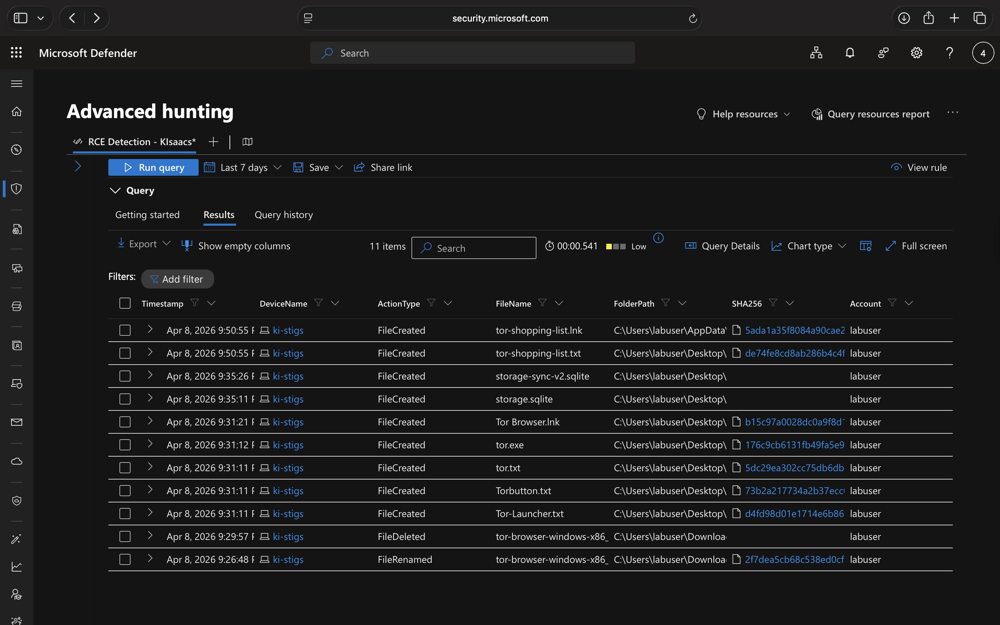
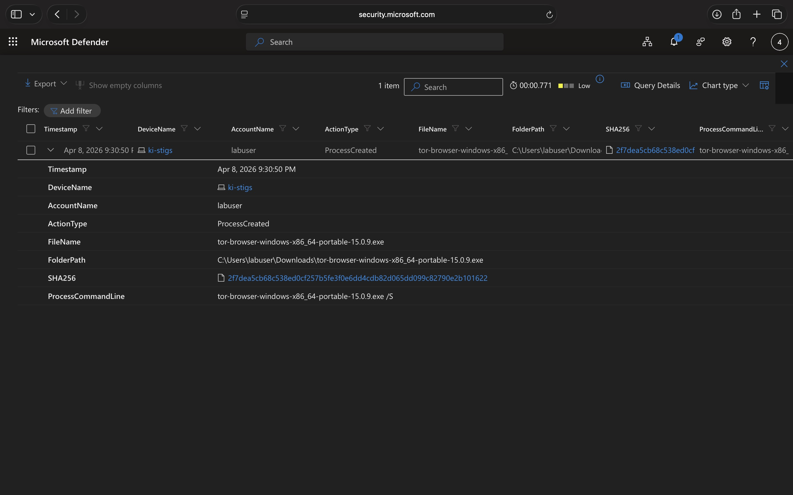
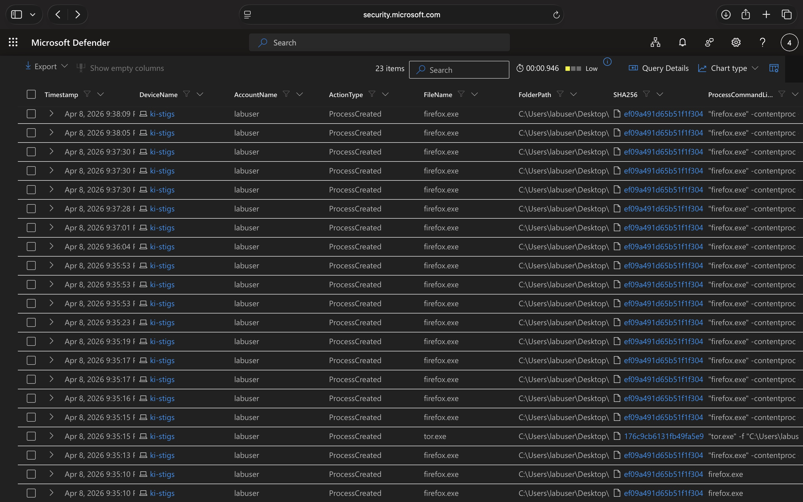
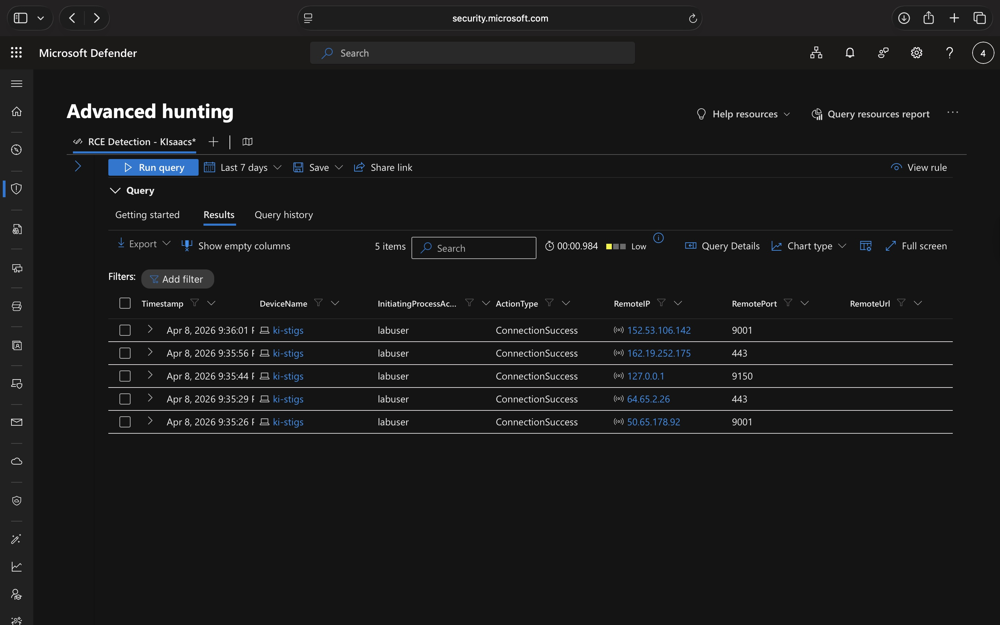

  

---

### Scenario Creation

➡️ <a href="tor-activity-simulation.md">View Scenario Creation</a>

---

### Platforms and Technologies Leveraged

- Windows 11 Virtual Machine (Microsoft Azure)  
- Endpoint Detection and Response (EDR): Microsoft Defender for Endpoint  
- Kusto Query Language (KQL)  
- TOR Browser  

---

### Scenario

Management suspects that employees might be using the TOR Browser to bypass network security controls after network logs showed unusual encrypted traffic patterns and connections to known TOR-related ports. Internal reporting also suggests that employees discussed ways to access restricted websites during work hours while avoiding normal monitoring. The objective of this threat hunt is to determine whether TOR Browser was downloaded, installed, and actively used on the endpoint, identify any related file, process, and network activity, and document the findings so management can be notified if unauthorized TOR use is confirmed.

---

### Investigation Approach

- Review **DeviceFileEvents** for TOR-related file artifacts  
- Analyze **DeviceProcessEvents** for evidence of installation and browser execution  
- Examine **DeviceNetworkEvents** for outbound connections over known TOR-associated ports

---

<h2>Steps Taken</h2>

<h3>1. Reviewed <code>DeviceFileEvents</code> for tor-related file activity</h3>

Files containing the string "tor" were reviewed on device ki-stigs under the labuser
account. The results show activity between 2026-04-09T01:26:48.5661396Z and
2026-04-09T01:50:55.9826167Z, beginning with installer-related activity in the Downloads
folder and followed by creation of multiple files on the Desktop, including
<code>tor.exe</code>, <code>Tor Browser.lnk</code>, <code>Tor-Launcher.txt</code>,
<code>Torbutton.txt</code>, and <code>tor-shopping-list.txt</code>. Taken together, the
events show these artifacts appearing first in Downloads and later on the Desktop during
the same session.

<strong>Query used to locate events:</strong>

<pre><code>DeviceFileEvents
| where DeviceName == 'ki-stigs'
| where InitiatingProcessAccountName == 'labuser'
| where FileName contains 'tor'
| where Timestamp &lt;= datetime(2026-04-09T01:50:55.9826167Z)
| where Timestamp &gt;= datetime(2026-04-09T01:26:48.5661396Z)
| order by Timestamp desc
| project Timestamp, DeviceName, ActionType, FileName, FolderPath, SHA256, Account = InitiatingProcessAccountName</code></pre>

<h3>2. Reviewed <code>DeviceProcessEvents</code> for tor installer execution</h3>

A ProcessCommandLine containing
<code>tor-browser-windows-x86_64-portable-15.0.9.exe</code> was reviewed on device
ki-stigs. At 2026-04-09T01:30:50.8034689Z, a ProcessCreated event shows labuser ran
<code>tor-browser-windows-x86_64-portable-15.0.9.exe</code> from the Downloads folder,
and the command line included the <code>/S</code> switch, indicating silent execution.
An additional process creation event for the same file further supports that the package
was actively run and not only present on disk.

<strong>Query used to locate events:</strong>

<pre><code>DeviceProcessEvents
| where DeviceName == 'ki-stigs'
| where ProcessCommandLine contains "tor-browser-windows-x86_64-portable-15.0.9.exe"
| project Timestamp, DeviceName, AccountName, ActionType, FileName, FolderPath, SHA256, ProcessCommandLine</code></pre>

<h3>3. Reviewed <code>DeviceProcessEvents</code> for tor browser execution</h3>

Execution of <code>tor.exe</code>, <code>firefox.exe</code>, and
<code>tor-browser.exe</code> was reviewed on device ki-stigs. The results show browser
execution beginning at 2026-04-09T01:35:10.2222606Z, when <code>firefox.exe</code> was
first observed. Additional ProcessCreated events for <code>firefox.exe</code> and
<code>tor.exe</code> followed shortly afterward, consistent with the tor browser and its
supporting process launching successfully.

<strong>Query used to locate events:</strong>

<pre><code>DeviceProcessEvents
| where DeviceName == 'ki-stigs'
| where FileName has_any ('tor.exe', 'firefox.exe', 'tor-browser.exe')
| project Timestamp, DeviceName, AccountName, ActionType, FileName, FolderPath, SHA256, ProcessCommandLine
| order by Timestamp desc</code></pre>

<h3>4. Reviewed <code>DeviceNetworkEvents</code> for tor-related network connections</h3>

Network connections tied to <code>tor.exe</code> and <code>firefox.exe</code> were
reviewed over known tor-related and relevant web ports. The results show successful
connections beginning at 2026-04-09T01:35:26.8247537Z, including traffic over
<code>9001</code>, <code>443</code>, and localhost over <code>9150</code>. This pattern
is consistent with tor-related network activity occurring shortly after browser launch.

<strong>Query used to locate events:</strong>

<pre><code>DeviceNetworkEvents
| where DeviceName == 'ki-stigs'
| where InitiatingProcessFileName in ('tor.exe', 'firefox.exe')
| where RemotePort in ('9001', '9030', '9040', '9050', '9051', '9150', '80', '443')
| project Timestamp, DeviceName, InitiatingProcessAccountName, ActionType, RemoteIP, RemotePort, RemoteUrl, InitiatingProcessFileName, InitiatingProcessFolderPath
| order by Timestamp desc</code></pre>

---

<h2>Chronological Event Timeline</h2>

This section summarizes the observed tor-related activity on device ki-stigs in chronological order.

<h3>1. Initial tor-related file activity in Downloads</h3>

<strong>Timestamp:</strong> 2026-04-09T01:26:48.5661396Z 
<strong>Event:</strong> The earliest tor-related file activity in the reviewed logs was observed in the Downloads folder, marking the beginning of the activity window associated with the tor browser package. 
<strong>Action:</strong> File activity detected. 
<strong>File Path:</strong> C:\Users\labuser\Downloads\

<h3>2. Silent execution of the tor installer</h3>

<strong>Timestamp:</strong> 2026-04-09T01:30:50.8034689Z 
<strong>Event:</strong> The file <code>tor-browser-windows-x86_64-portable-15.0.9.exe</code> was executed from the Downloads folder. The ProcessCommandLine included the <code>/S</code> switch, indicating the installer was run silently. 
<strong>Action:</strong> Process creation detected. 
<strong>Command:</strong> tor-browser-windows-x86_64-portable-15.0.9.exe /S 
<strong>File Path:</strong> C:\Users\labuser\Downloads\tor-browser-windows-x86_64-portable-15.0.9.exe

<h3>3. Tor-related files created on the Desktop</h3>

<strong>Timestamps:</strong> 2026-04-09T01:31:11Z to 2026-04-09T01:31:21Z 
<strong>Event:</strong> Multiple tor-related files were created on the Desktop shortly after the installer execution, including <code>tor.exe</code> and <code>Tor Browser.lnk</code>, along with additional tor-related text and launcher files. 
<strong>Action:</strong> File creation detected. 
<strong>File Path:</strong> C:\Users\labuser\Desktop\

<h3>4. Tor browser launch activity</h3>

<strong>Timestamp:</strong> 2026-04-09T01:35:10.2222606Z 
<strong>Event:</strong> Tor browser execution was observed when <code>firefox.exe</code> was first created. Additional <code>firefox.exe</code> and <code>tor.exe</code> process creation events followed, showing the browser and supporting tor process were launched successfully. 
<strong>Action:</strong> Process creation of tor browser-related executables detected. 
<strong>File Path:</strong> C:\Users\labuser\Desktop\Tor Browser\

<h3>5. Tor-related network connections established</h3>

<strong>Timestamp:</strong> 2026-04-09T01:35:26.8247537Z 
<strong>Event:</strong> Successful network connections associated with <code>tor.exe</code> and <code>firefox.exe</code> were observed shortly after launch, including traffic over ports <code>9001</code>, <code>443</code>, and localhost over <code>9150</code>. 
<strong>Action:</strong> Connection success detected. 
<strong>Process:</strong> tor.exe / firefox.exe

<h3>6. Later Desktop file creation</h3>

<strong>Timestamp:</strong> 2026-04-09T01:50:55.9826167Z 
<strong>Event:</strong> A file named <code>tor-shopping-list.txt</code> was created on the Desktop, along with a related shortcut file, showing tor-related file activity continued after the browser execution and network activity had already begun. 
<strong>Action:</strong> File creation detected. 
<strong>File Path:</strong> C:\Users\labuser\Desktop\tor-shopping-list.txt

---

<h2>Final Assessment</h2>

The reviewed file, process, and network events support that tor-related software was
downloaded, executed silently, launched, and used on device ki-stigs under the labuser
account during the reviewed time window. If this activity was not authorized, the device
should be reviewed for containment and management should be notified for follow-on
investigation.

