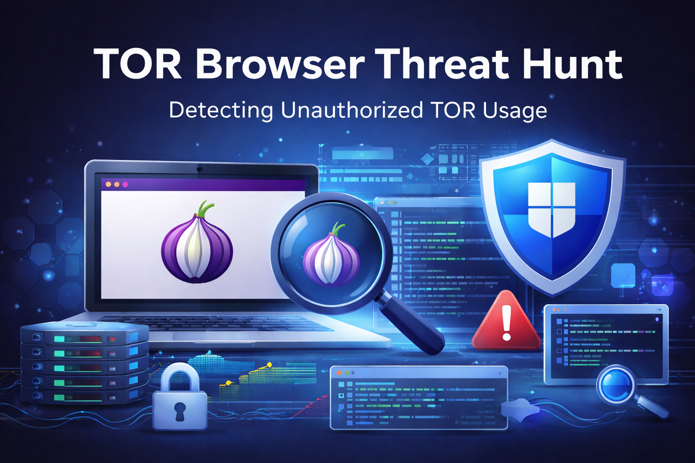

  

  <a href="README.md">⬅ Back to Main Report</a>

---

<h1>Threat Event (Unauthorized TOR Usage)</h1>

<strong>Unauthorized TOR Browser Installation and Use</strong>

---

<h2>Steps the "Bad Actor" Took to Create Logs and IoCs</h2>

<ol>
  <li>Download the TOR Browser installer from the official TOR Project website: https://www.torproject.org/download/</li>
  <li>
    Execute the installer silently:
    <pre><code>tor-browser-windows-x86_64-portable-15.0.9.exe /S</code></pre>
  </li>
  <li>Launch the TOR Browser from the extracted folder on the Desktop.</li>
  <li>
    Browse a few websites through TOR to generate browser, process, and network activity.
    <ul>
      <li>Browsing standard websites through TOR is sufficient to generate the necessary logs.</li>
      <li>To find valid Tor/.onion links that are still up, you can use this website: https://onion.live/</li>
    </ul>
  </li>
  <li>Create a text file on the Desktop with "Tor" in the name and add miscellaneous text files to generate file creation activity.</li>
</ol>

---

<h2>Tables Used to Detect IoCs</h2>

<table>
  <tr>
    <th>Table Name</th>
    <th>Purpose</th>
  </tr>
  <tr>
    <td><strong>DeviceFileEvents</strong></td>
    <td>Used to detect TOR-related file activity, including installer-related artifacts, Desktop file creation, and creation of <code>tor-shopping-list.txt</code>.</td>
  </tr>
  <tr>
    <td><strong>DeviceProcessEvents</strong></td>
    <td>Used to detect silent execution of the TOR installer and subsequent launch of TOR browser-related processes such as <code>firefox.exe</code> and <code>tor.exe</code>.</td>
  </tr>
  <tr>
    <td><strong>DeviceNetworkEvents</strong></td>
    <td>Used to detect TOR-related network connections associated with <code>tor.exe</code> and <code>firefox.exe</code>, including traffic over ports commonly seen with TOR activity.</td>
  </tr>
</table>

---

<h2>Related Queries</h2>

<pre><code class="language-kql">// Review TOR-related file activity
DeviceFileEvents
| where FileName contains "tor"
| project Timestamp, DeviceName, ActionType, FileName, FolderPath, SHA256, InitiatingProcessAccountName
| order by Timestamp desc

// Detect silent execution of the TOR installer
DeviceProcessEvents
| where ProcessCommandLine contains "tor-browser-windows-x86_64-portable-15.0.9.exe"
| project Timestamp, DeviceName, AccountName, ActionType, FileName, FolderPath, SHA256, ProcessCommandLine

// Detect TOR browser-related process execution
DeviceProcessEvents
| where FileName has_any ("tor.exe", "firefox.exe", "tor-browser.exe")
| project Timestamp, DeviceName, AccountName, ActionType, FileName, FolderPath, SHA256, ProcessCommandLine
| order by Timestamp desc

// Detect TOR-related network connections
DeviceNetworkEvents
| where InitiatingProcessFileName in ("tor.exe", "firefox.exe")
| where RemotePort in ("9001", "9030", "9040", "9050", "9051", "9150", "80", "443")
| project Timestamp, DeviceName, InitiatingProcessAccountName, ActionType, RemoteIP, RemotePort, RemoteUrl, InitiatingProcessFileName, InitiatingProcessFolderPath
| order by Timestamp desc

// Detect creation of the shopping list file
DeviceFileEvents
| where FileName contains "tor-shopping-list.txt"
| project Timestamp, DeviceName, ActionType, FileName, FolderPath, SHA256, InitiatingProcessAccountName
| order by Timestamp desc
</code></pre>

---

<h2>Created By</h2>
<ul>
  <li><strong>Author Name:</strong> Keisha Isaacs </li>
  <li><strong>Date:</strong> 04/12/26 </li>
</ul>

---

<h2>Additional Notes</h2>
<ul>
  <li>This scenario is intended to simulate unauthorized TOR Browser installation and usage in a lab environment.</li>
</ul>

---
